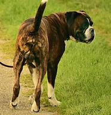

.. DeepStack documentation master file, created by
   sphinx-quickstart on Wed Dec 12 17:30:35 2018.
   You can adapt this file completely to your liking, but it should at least
   contain the root `toctree` directive.

Object Detection
=================

The object detection API locates and classifies 80 different kinds of objects in a single image.

To use this API, you need to set **VISION-DETECTION=True** when starting DeepStack ::

    sudo docker run -e VISION-DETECTION=True -v localstorage:/datastore \
    -p 80:5000 deepquestai/deepstack

If using the GPU Version, run ::

    sudo docker run --rm --runtime=nvidia -e VISION-DETECTION=True -v localstorage:/datastore \
    -p 80:5000 deepquestai/deepstack:gpu

*Note also that you can have multiple endpoints activated, for example, both face and object detection are activated below* ::

    sudo docker run -e VISION-DETECTION=True  -e VISION-FACE=True -v localstorage:/datastore \
    -p 80:5000 deepquestai/deepstack

**Example**

.. figure:: test-image3.jpg
    :align: center

::

    using System;
    using System.IO;
    using System.Net.Http;
    using System.Threading.Tasks;
    using Newtonsoft.Json;

    namespace appone
    {

    class Response {
        
        public bool success {get;set;}
        public Object[] predictions {get;set;}

    }

    class Object {

        public string label {get;set;}
        public float confidence {get;set;}
        public int y_min {get;set;}
        public int x_min {get;set;}
        public int y_max {get;set;}
        public int x_max {get;set;}
    
    }

    class App {

        static HttpClient client = new HttpClient();

        public static async Task detectFace(string image_path){

            var request = new MultipartFormDataContent();
            var image_data = File.OpenRead(image_path);
            request.Add(new StreamContent(image_data),"image",Path.GetFileName(image_path));
            var output = await client.PostAsync("http://localhost:80/v1/vision/detection",request);
            var jsonString = await output.Content.ReadAsStringAsync();
            Response response = JsonConvert.DeserializeObject<Response>(jsonString);
            
            foreach (var user in response.predictions){

                Console.WriteLine(user.label);

            }

            Console.WriteLine(jsonString);

        }

        static void Main(string[] args){

            detectFace("test-image3.jpg").Wait();

        }

    }
    
    }

Result ::

    dog
    person
    person
    {'predictions': [{'x_max': 819, 'x_min': 633, 'y_min': 354, 'confidence': 99, 'label': 'dog', 'y_max': 546}, {'x_max': 601, 'x_min': 440, 'y_min': 116, 'confidence': 99, 'label': 'person', 'y_max': 516}, {'x_max': 445, 'x_min': 295, 'y_min': 84, 'confidence': 99, 'label': 'person', 'y_max': 514}], 'success': True}

We can use the coordinates returned to extract the objects

::

    using System;
    using System.IO;
    using System.Net.Http;
    using System.Threading.Tasks;
    using Newtonsoft.Json;
    using SixLabors.ImageSharp;
    using SixLabors.ImageSharp.Processing;
    using SixLabors.Primitives;

    namespace appone
    {

    class Response {

    public bool success {get;set;}
    public Object[] predictions {get;set;}

    }

    class Object {

    public string label {get;set;}
    public float confidence {get;set;}
    public int y_min {get;set;}
    public int x_min {get;set;}
    public int y_max {get;set;}
    public int x_max {get;set;}

    }

    class App {

    static HttpClient client = new HttpClient();

    public static async Task recognizeFace(string image_path){

        var request = new MultipartFormDataContent();
        var image_data = File.OpenRead(image_path);
        request.Add(new StreamContent(image_data),"image",Path.GetFileName(image_path));
        var output = await client.PostAsync("http://localhost:80/v1/vision/detection",request);
        var jsonString = await output.Content.ReadAsStringAsync();
        Response response = JsonConvert.DeserializeObject<Response>(jsonString);

        var i = 0;

        foreach (var user in response.predictions){

            var width = user.x_max - user.x_min;
            var height = user.y_max - user.y_min;

            var crop_region = new Rectangle(user.x_min,user.y_min,width,height);

            using(var image = Image.Load(image_path)){

                image.Mutate(x => x
                .Crop(crop_region)
                );
                image.Save(user.label + i.ToString() + "_.jpg");

            }

            i++;

        }

        }

        static void Main(string[] args){

            recognizeFace("test-image3.jpg").Wait();

        }

    }

    }

Result

.. figure:: image1_person.jpg
    :align: center

**CLASSES**

The following are the classes of objects DeepStack can detect in images ::

    person,   bicycle,   car,   motorcycle,   airplane,
    bus,   train,   truck,   boat,   traffic light,   fire hydrant,   stop_sign,
    parking meter,   bench,   bird,   cat,   dog,   horse,   sheep,   cow,   elephant,  
    bear,   zebra, giraffe,   backpack,   umbrella,   handbag,   tie,   suitcase,   
    frisbee,   skis,   snowboard, sports ball,   kite,   baseball bat,   baseball glove, 
    skateboard,   surfboard,   tennis racket, bottle,   wine glass,   cup,   fork,   
    knife,   spoon,   bowl,   banana,   apple,   sandwich,   orange, broccoli,   carrot,   
    hot dog,   pizza,   donot,   cake,   chair,   couch,   potted plant,   bed, dining table,   
    toilet,   tv,   laptop,   mouse,   remote,   keyboard,   cell phone,   microwave,
    oven,   toaster,   sink,   refrigerator,   book,   clock,   vase,   scissors,   teddy bear,
    hair dryer, toothbrush.
