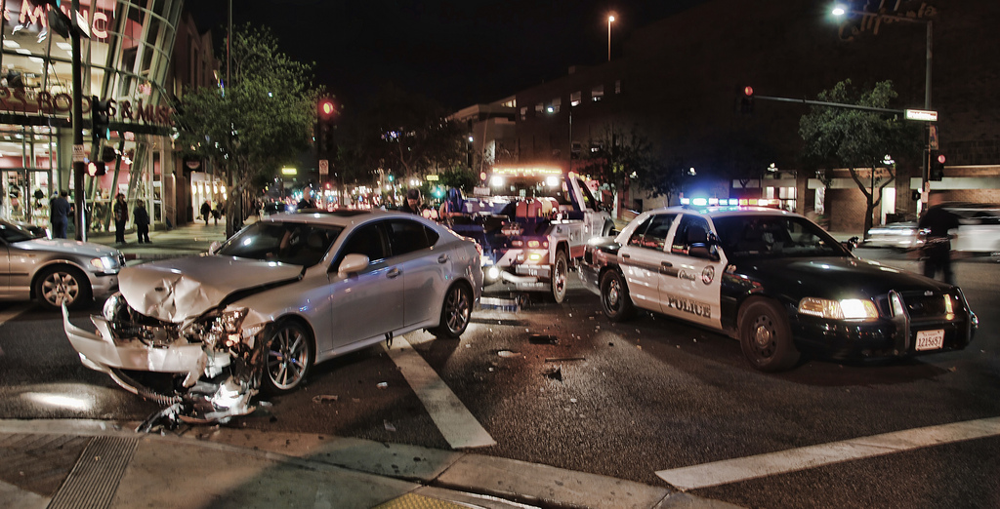

.. DeepStack documentation master file, created by
   sphinx-quickstart on Wed Dec 12 17:30:35 2018.
   You can adapt this file completely to your liking, but it should at least
   contain the root `toctree` directive.

Traffic Recognition
====================

The traffic recognition API classifies an image into one of the following ::

    Sparse traffic

    Dense traffic

    Accident

    Fire

With this, from images of live traffic, you can tell if an accident has occured,
if their is traffic gridlock or if a vehicle is on fire.

To use this API, you need to set **VISION-TRAFFIC=True** when starting DeepStack ::

    sudo docker run -e VISION-TRAFFIC=True -v localstorage:/datastore \
    -p 80:5000 deepquestai/deepstack

If using the GPU Version, run ::

    sudo docker run --rm --runtime=nvidia -e VISION-TRAFFIC=True -v localstorage:/datastore \
    -p 80:5000 deepquestai/deepstack:gpu

*Note also that you can have multiple endpoints activated, for example, both traffic and object detection are activated below* ::

    sudo docker run -e VISION-TRAFFIC=True  -e VISION-DETECTION=True -v localstorage:/datastore \
    -p 80:5000 deepquestai/deepstack

**Example**

::

    using System;
    using System.IO;
    using System.Net.Http;
    using System.Threading.Tasks;

    namespace app
    {

        class App {

        static HttpClient client = new HttpClient();

        public static async Task makeRequest(){

            var request = new MultipartFormDataContent();
            var image_data = File.OpenRead("image.jpg");
            request.Add(new StreamContent(image_data),"image",Path.GetFileName("test-image4.jpg"));
            var output = await client.PostAsync("http://localhost:80/v1/vision/traffic",request);
            var jsonString = await output.Content.ReadAsStringAsync();
            
            Console.WriteLine(jsonString);

        }

        static void Main(string[] args){

            makeRequest().Wait();

        }

        }
    
    }

Result ::

    {'success': True, 'confidence': 94.88776, 'label': 'accident'}
